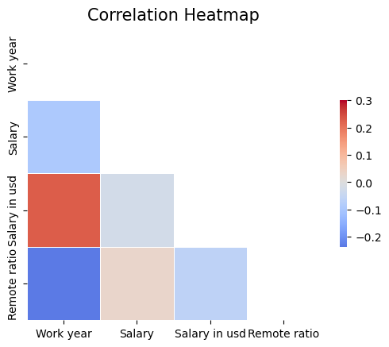

# Data_Science_Salaries
## 1 Table of Contents:
    Introduction
        Background
        The Data
    Data Analysis
        Correlation Heatmap
        Jobs by Title
        Jobs by Median Salary (barh)
        Jobs by Median Salary (box plot)
        Salary by Experience Level
    Conclusions
    Further Exploration

## 2 Introduction:
### 2.1 Background:
Since I am taking a Data Analytic course I became interested in what the potential salaries available in the Data Science field. While not exectly the same, there is a more than reasonable overlap. My intent is to get a general idea of the salary ranges and job descriptions available. 

### 2.2 The Data:
##### 2.2.1 This dataset can be found at:
https://www.kaggle.com/datasets/arnabchaki/data-science-salaries-2023

(Data originally was sourced from aijobs.net)

##### 2.2.2 My dataset repository is located at:
https://github.com/bobebend/Data_Science_Salaries

##### 2.2.3 Describe the fields:
There are 3755 rows and 11 columns of data.
The 11 columns of data are:
    -work year*
    -experience level
    -employment type
    -job title
    -salary*
    -salary currency*
    -salary in usd
    -employee residence
    -remote ratio
    -company location
    -company size
It should be noted the the columns marked with a * were not used in my analysis for the following reasons.
-work year: this dataset used information from 2020 through 2023 with the bulk of the data from 2022 to 2023. Given the short time period, the salaries in all years are relevent. In addition, the focus of of this analysis are the salaries themselves.
-salary and salary currency: 3000 rows were already in USD and the remaining non-USD salaries were converted to USD in their own column.

To calulate salaries I used median instead of mean. I found there were a very few high salary jobs skewing the data so using the median helped account for this. 
    
## 3 Data Analysis:
### 3.1 Correlation Heatmap:
After a cursory inspection of the data I wanted to see if there was a linear correlation between any of the data. I found there were no strong linear correlations in my data indicating no consistent linear pattern of change between the data categories.

](images/image.png)

### 3.2 Top 20 Job Titles:
To get an idea of the what job titles there were, I used a horizontal bar graph to look at the top 20 job titles. I found 2,781 of the 3,755 jobs listed were from four job titles; Data Engineer(1,040), Data Scientist(840), Data Analyst(612), and Machine Learning Engineer(289). The other titles were 103 or fewer positions making a rather sharp divide among job titles.

](images/image-1.png)

### 3.3 Top 20 Median Salary Job Titles:
Next, I used a horizontal bar graph to examine the top 20 median salary job titles. The graph was useful but I wanted to get a clearer picture of the salary ranges.

](images/image-2.png)

### 3.4 Top Jobs by Median Salary:
To get a clearer idea of the salary ranges, I used a box plot. The box plot showed the median salary as approximately $100,000 with an expected range between $77,500 to $126,250. It should be noted the lower salaries could be accounted for by part time positions and wages paid in other countries where there may be an unfavorable exchange rate like India. Higher salaries are accounted for by senior positions and a few large salary earners.

](images/image-3.png)

### 3.5 Median Salary by Experience Level:
The last analysis I did was to compare median salaries to experience level. As expected, salaries increased as the experience level did. The median salary for each experience level are as follows: Entry - 80,000, Middle - 100,000, Senior - 148,000, and Executive - 200,000.

](images/image-4.png)

## 4 Conclusions:
Based off the data I analysed from this file, I have shown the most common job titles and the salaries associated with them. Median Entry and Middle experience jobs offer fairly good pay. I should be noted that this data does not take into account other factors which may increase an individuals earning potential like other skills and experience. Someone could use their other skills AND data science knowledge to find a job that combines them both and offers a higher salary. 
    

## 5 Potential Further Avenues of Inquiry:
1. Review additional datasets. 
2. Does the actual work for each job title vary by company.
3. Include degrees/credentials/experience and impact on salary.
4. Experience level per job title, promotion timelines and requirements.